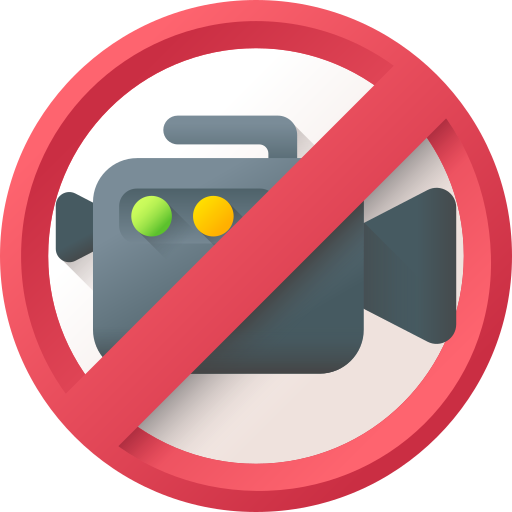

An extension, that blocks Youtube Shorts.

# Shorts Block

Shorts Block is an easy-to-use browser extension that interacts with the DOM to disable YouTube Shorts, which can overwhelm the user experience.
You will still be able to watch shorts, but unlike in the actual polluted YouTube, you need to reach the shorts tab and show interest in seeing them.

#### Disclaimer:
In this version, the extension may not work properly on browsers that do not use the Chromium engine.

## Implemented Features

- [X] Remove YouTube Shorts visibility from Home, Results and Trending.

- [X] Automatically convert Shorts videos into a regular format(In progress).

- [X] Remove Youtube Shorts section, while watching a video.

